# ProofKind Google Stack Architecture

```mermaid
flowchart TB
  subgraph Users["Users"]
    Owner["Authenticated profile owner"]
    Visitor["Anonymous public visitor"]
  end

  subgraph Experience["Experience layer"]
    OwnerWorkbench["Owner private AI workbench"]
    OwnerSetup["Owner conversational setup"]
    ApprovalUI["Claim approval workspace"]
    PublicProfile["Public profile page"]
    FitChat["Public profile assistant chat"]
  end

  subgraph FirebaseApp["Firebase application layer"]
    Next["Next.js app"]
    Hosting["Firebase App Hosting"]
    Auth["Firebase Authentication"]
    TenantRegistry["Tenant registry and membership"]
    Rules["Firebase Security Rules"]
    AppCheck["Firebase App Check"]
  end

  subgraph GenkitLayer["Genkit agent workflow layer"]
    ToolBroker["Policy-aware tool broker"]
    SetupFlow["Setup flow"]
    DiscoveryFlow["Source discovery flow"]
    IngestionFlow["Ingestion orchestration flow"]
    RefreshFlow["Refresh flow"]
    OwnerResearchFlow["Owner research flow"]
    ExtractionFlow["Evidence extraction flow"]
    WebResearchFlow["Company and product web research flow"]
    GapFlow["Gap interview flow"]
    ApprovalFlow["Approval flow"]
    FitFlow["Public profile assistant flow"]
  end

  subgraph ConnectorRuntime["Connector runtime layer"]
    Registry["Connector registry"]
    Installs["Tenant connector installs"]
    AdapterContract["Connector adapter contract"]
    MCPAdapter["MCP adapter later"]
  end

  subgraph Sources["Owner-approved source connectors"]
    Uploads["Manual uploads"]
    Drive["Google Drive API"]
    BloggerAPI["Blogger API"]
    URLs["Approved URLs and URL Context"]
    LinkedIn["LinkedIn export"]
    GitHub["GitHub URLs"]
    YouTube["YouTube transcripts"]
    Search["Gemini Google Search grounding"]
    Future["Future Canva / Trello / Notion"]
  end

  subgraph Jobs["Refresh and processing jobs"]
    Scheduler["Cloud Scheduler"]
    Tasks["Cloud Tasks queues"]
    Worker["Cloud Run task worker service"]
    Backfill["Cloud Run backfill jobs"]
    Inventory["Recursive inventory and delta sync"]
    Parser["Docling / MarkItDown / Unstructured"]
    Chunker["Chunking and normalization"]
    Classifier["Sensitivity and rights classifier"]
    Embedder["Gemini embeddings"]
  end

  subgraph GoogleData["Google data layer"]
    Firestore["Cloud Firestore"]
    Storage["Cloud Storage for Firebase"]
    TenantDocs["tenants/{tenantId}/..."]
    TenantFiles["tenants/{tenantId}/... storage paths"]
    PrivateIndex["Private Firestore vector index"]
    PublicIndex["Public Firestore vector index"]
    AgentRuns["Agent runs and audit logs"]
  end

  subgraph PrivateBoundary["Private owner workspace"]
    PrivateCorpus["Private raw corpus"]
    SourceChunks["Private parsed chunks"]
    DraftClaims["Draft evidence and claim graph"]
    OwnerAnswers["Owner interview answers"]
    PsychProfile["Private psychometric profile"]
    Timeline["CV timeline and career history"]
  end

  subgraph PublicBoundary["Approved public boundary"]
    ApprovedClaims["Approved public claims"]
    ApprovedArtifacts["Approved artifact summaries"]
    ApprovedSections["Approved profile sections"]
    PublicCorpus["Approved public corpus"]
  end

  subgraph AI["Google AI layer"]
    Gemini["Gemini API"]
    GeminiFlash["Gemini Flash-class models"]
    GeminiPro["Gemini Pro-class model for hard synthesis"]
  end

  subgraph Safety["Trust and safety layer"]
    PromptControls["Prompt injection controls"]
    VisibilityPolicy["Visibility policy engine"]
    LeakTests["Leak and unsupported claim tests"]
    Deletion["Deletion and export lineage"]
    Secrets["Secret Manager and IAM"]
  end

  subgraph Growth["Validation services"]
    Analytics["Firebase / Google Analytics"]
    Booking["Cal.com or Calendly"]
    Email["Email later"]
    Billing["Stripe later"]
  end

  Owner --> OwnerWorkbench
  Owner --> OwnerSetup
  OwnerWorkbench --> Next
  OwnerSetup --> Next
  ApprovalUI --> Next
  Visitor --> PublicProfile
  Visitor --> FitChat

  Next --> Hosting
  Next --> Auth
  Auth --> TenantRegistry
  Next --> Rules
  Next --> AppCheck

  OwnerSetup --> ToolBroker
  OwnerWorkbench --> ToolBroker
  FitChat --> ToolBroker
  ToolBroker --> SetupFlow
  ToolBroker --> OwnerResearchFlow
  ToolBroker --> FitFlow

  SetupFlow --> DiscoveryFlow
  DiscoveryFlow --> Registry
  Registry --> Installs
  Installs --> AdapterContract
  AdapterContract --> Sources
  MCPAdapter -. approved external tools .-> AdapterContract
  Sources --> IngestionFlow
  Scheduler --> RefreshFlow
  RefreshFlow --> Installs
  Installs --> Sources
  IngestionFlow --> Storage
  IngestionFlow --> Tasks
  RefreshFlow --> Tasks
  Tasks --> Worker
  Worker --> Inventory
  Backfill -. controlled reprocessing .-> Inventory
  Inventory --> Parser
  Parser --> Chunker
  Chunker --> Classifier
  Classifier --> Embedder
  Embedder --> Firestore
  Firestore --> TenantDocs
  Storage --> TenantFiles
  Storage --> PrivateCorpus
  Firestore --> SourceChunks
  SourceChunks --> PrivateIndex

  PrivateIndex --> OwnerResearchFlow
  DraftClaims --> OwnerResearchFlow
  OwnerAnswers --> OwnerResearchFlow
  PsychProfile --> OwnerResearchFlow
  Timeline --> OwnerResearchFlow

  OwnerResearchFlow --> Gemini
  ExtractionFlow --> GeminiFlash
  WebResearchFlow --> Gemini
  GapFlow --> GeminiFlash
  ApprovalFlow --> GeminiFlash
  FitFlow --> GeminiFlash
  GeminiPro -. hard synthesis only .-> OwnerResearchFlow

  SourceChunks --> ExtractionFlow
  ExtractionFlow --> Timeline
  ExtractionFlow --> PsychProfile
  ExtractionFlow --> DraftClaims
  DraftClaims --> WebResearchFlow
  WebResearchFlow --> DraftClaims
  DraftClaims --> GapFlow
  GapFlow --> OwnerAnswers
  OwnerAnswers --> DraftClaims
  DraftClaims --> ApprovalFlow
  ApprovalFlow --> ApprovalUI
  ApprovalUI --> ApprovedClaims
  ApprovalUI --> ApprovedArtifacts
  ApprovalUI --> ApprovedSections

  ApprovedClaims --> PublicCorpus
  ApprovedArtifacts --> PublicCorpus
  ApprovedSections --> PublicCorpus
  PublicCorpus --> PublicIndex
  PublicCorpus --> PublicProfile
  FitFlow --> PublicIndex

  Firestore --> AgentRuns
  TenantRegistry --> ToolBroker
  PromptControls --> OwnerResearchFlow
  PromptControls --> ExtractionFlow
  PromptControls --> FitFlow
  VisibilityPolicy --> PublicCorpus
  LeakTests --> FitFlow
  Deletion --> PrivateCorpus
  Deletion --> SourceChunks
  Deletion --> DraftClaims
  Deletion --> PublicCorpus
  Secrets --> SetupFlow
  Secrets --> OwnerResearchFlow
  Secrets --> AdapterContract

  PublicProfile --> Analytics
  FitChat --> Analytics
  FitChat --> Booking
  Email -. later .-> Next
  Billing -. later .-> Next
```

## Stack Summary

- **Web app:** Next.js.
- **Hosting:** Firebase App Hosting.
- **Authentication:** Firebase Authentication.
- **Database:** Cloud Firestore.
- **File storage:** Cloud Storage for Firebase.
- **Agent framework:** Genkit.
- **Model runtime:** Gemini API.
- **Retrieval:** Firestore Vector Search.
- **Task workers:** Cloud Run Services behind Cloud Tasks.
- **Bulk backfills:** Cloud Run Jobs.
- **Scheduled refresh:** Cloud Scheduler.
- **Task queue:** Cloud Tasks for per-source and per-file ingestion dispatch.
- **Tenant model:** `tenants/{tenantId}` private workspace roots plus materialized `publicProfiles/{slug}`.
- **Connector model:** global connector registry plus tenant-specific connector installs.
- **Tool security:** policy-aware tool broker resolves tenant, mode, visibility, and allowed tools server-side.
- **Primary source connector:** Google Drive API.
- **Blog connector:** Blogger API.
- **Web research:** Gemini Google Search grounding and URL Context.
- **Future connector adapter:** MCP can be supported later behind the ProofKind policy broker.
- **Parsing:** Docling, MarkItDown, and Unstructured running inside Cloud Run workers.
- **Owner runtime rule:** authenticated owners can query their full private and public corpus.
- **Public runtime rule:** anonymous visitors can query only the approved public corpus.
