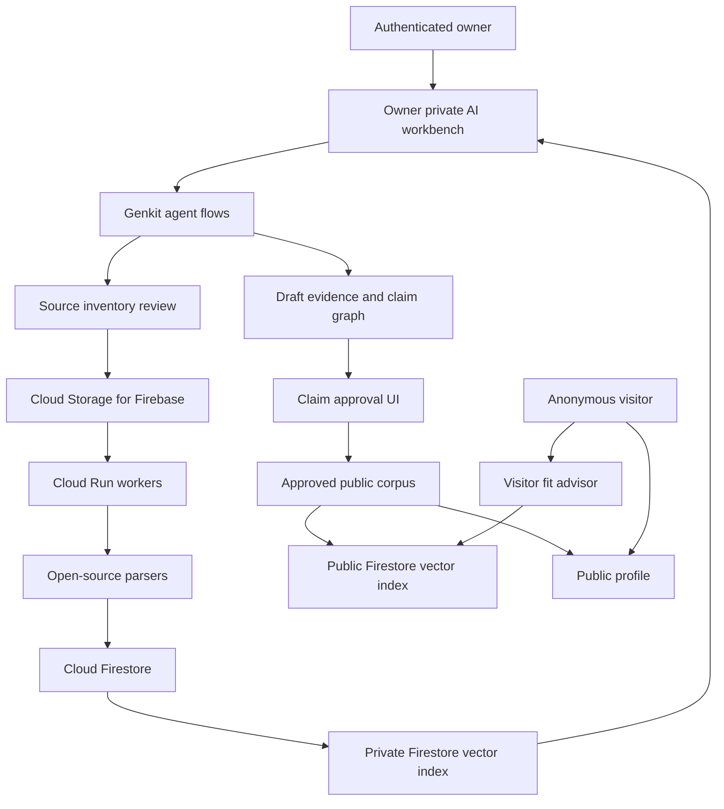

# ProofKind Google Stack Technical Architecture Plan

Status: locked v1 stack  
Date: 2026-06-16  
Related: [Product Vision](./productVision.md), [Stack Diagram](./architectureStackDiagram.md), [Canonical Data Model](./canonicalDataModel.md), [Data Ingestion Architecture](./dataIngestionArchitecture.md), [Connector And Multi-Tenant Architecture](./connectorMultiTenantArchitecture.md), [Professional Memory And Coach](./professionalMemoryCoach.md)

## Executive Recommendation

Build ProofKind on a deliberately narrow Google-first stack:

- **Next.js on Firebase App Hosting**
- **Firebase Authentication**
- **Cloud Firestore**
- **Cloud Storage for Firebase**
- **Genkit**
- **Gemini API**
- **Firestore Vector Search**
- **Cloud Run Services**
- **Cloud Run Jobs**
- **Cloud Scheduler**
- **Cloud Tasks**
- **Google Drive API**
- **Blogger API**
- **ProofKind Connector Runtime**
- **Policy-aware Tool Broker**

Use open-source parsing libraries inside Cloud Run workers, but avoid adding a second SaaS backend, a separate vector database, or another agent framework in v1.

The long-term product architecture remains:

```text
private ingestion + owner synthesis
  -> draft evidence and claim graph
  -> owner review and approval
  -> approved public corpus
  -> public profile and visitor fit advisor
```

The build order has been updated on 2026-06-18: Phase 1 now proves the ingestion-to-profile-generation engine. The public profile and visitor fit advisor remain important, but they are downstream consumers of generated, evidence-backed profile material rather than the initial source of truth.

## Locked Stack

| Layer | Decision | Purpose |
|---|---|---|
| Web app | Next.js | Owner workspace, approval UI, public profile, visitor fit chat |
| Hosting | Firebase App Hosting | Full-stack Next.js deployment on Google-managed infrastructure |
| Authentication | Firebase Authentication | Owner login and future beta user accounts |
| Database | Cloud Firestore | Sources, chunks, claims, approvals, profiles, fit sessions, agent runs |
| File storage | Cloud Storage for Firebase | Uploaded CVs, documents, exports, samples, generated artifacts |
| Agent runtime | Genkit | Agentic flows, tools, schemas, local debugging, server-side AI calls |
| AI model | Gemini API | Chat, extraction, synthesis, embeddings, fit analysis |
| Retrieval | Firestore Vector Search | Owner private search and approved public search |
| Task workers | Cloud Run Services | HTTP task handlers invoked by Cloud Tasks for per-file/per-source work |
| Bulk backfills | Cloud Run Jobs | Long-running batch backfills and controlled reprocessing |
| Scheduled refresh | Cloud Scheduler | Periodic Drive, Blogger, LinkedIn-import reminder, and web-research refresh jobs |
| Task queue | Cloud Tasks | Per-source and per-file ingestion dispatch, retries, rate limits, and idempotent processing |
| Primary connector | Google Drive API | Recursive owner-approved folder ingestion and refresh |
| Blog connector | Blogger API | Blog post ingestion, parsing, mining, and refresh |
| Web research | Gemini Grounding with Google Search and URL Context | Company, product, and public article discovery from extracted anchors |
| Connector runtime | ProofKind Connector Runtime | Standard adapter contract for Drive, Blogger, LinkedIn import, GitHub, Canva, Trello, MCP, and future sources |
| Tool broker | Policy-aware Tool Broker | Tenant-scoped, mode-scoped AI tool access for owner/private and public/visitor chat |
| Secrets | Google Secret Manager | API keys and OAuth secrets |
| Security | Firebase Security Rules, App Check, IAM | Boundary enforcement and client abuse protection |
| Logging | Firebase/Cloud Logging plus Genkit developer UI | Debugging, traces, failures, cost review |

## Why This Stack

Firebase App Hosting supports dynamic Next.js apps and integrates with Firebase products such as Authentication, Cloud Firestore, and Firebase AI Logic. Genkit is Google's open-source framework for building agentic apps with workflows, tool calls, structured outputs, local development, and deployment paths to Firebase and Cloud Run. Firestore Vector Search allows KNN search over embeddings stored in Firestore, so v1 does not need Pinecone, Weaviate, Qdrant, or Supabase pgvector. Cloud Tasks is included because large Drive folders need reliable per-file dispatch, retry, rate limiting, and idempotent workers rather than one brittle long-running sync script. Cloud Tasks should call Cloud Run service endpoints for per-file work; Cloud Run Jobs are reserved for bulk backfills.

Key sources:

- [Firebase App Hosting](https://firebase.google.com/docs/app-hosting)
- [Genkit](https://genkit.dev/)
- [Firebase AI Logic](https://firebase.google.com/docs/ai-logic)
- [Firestore Vector Search](https://firebase.google.com/docs/firestore/vector-search)
- [Cloud Run Jobs](https://cloud.google.com/run/docs/create-jobs)
- [Cloud Tasks](https://docs.cloud.google.com/tasks/docs/creating-queues)

## User Access Model

ProofKind has two distinct AI experiences.

Every private experience is tenant-scoped. The founder MVP has one personal tenant; future users each receive their own personal tenant by default. The data model uses `tenantId` from day one rather than baking the product around one `uid`.

### Owner Private Workbench

The owner can ask questions across all of their own data:

- private raw sources
- public sources
- parsed source chunks
- draft claims
- approved claims
- rejected claims
- source metadata
- owner interview answers
- generated profile sections
- visitor questions and fit-session analytics
- journals and reflection notes
- performance reviews and feedback reports
- goals, development plans, and decision journals
- private professional memory and coaching sessions

This is where the owner can ask:

- "What evidence do I have for product leadership?"
- "Which old project is relevant to this new problem?"
- "Find artifacts that support my banking experience."
- "Where does my corpus contradict itself?"
- "Generate a CV draft for this role from approved and private evidence."
- "What do I know about workflow automation from previous work?"
- "What patterns define my best work?"
- "Prepare me for my performance review."
- "Does this opportunity fit my working style and goals?"

Owner answers may disclose private material to the owner, but they must clearly label sensitivity, source, confidence, and whether something is safe to publish.

### Professional Memory And Coach

The long-term private product direction is defined in [Professional Memory And Coach](./professionalMemoryCoach.md).

The owner workbench can evolve into a professional coach by combining:

- evidence-backed career history
- reflective memory
- psychometric context
- performance and feedback history
- goals and development plans
- opportunity evaluations
- decision journal entries

This coaching layer is private by default. It can help with performance review preparation, promotion cases, interview preparation, opportunity fit, difficult conversation rehearsal, proof-gap monitoring, and career strategy. It must stay in professional development and avoid therapy, diagnosis, employer surveillance, or automated employment decisioning.

### Public Visitor Experience

The public visitor agent can query only the approved public corpus:

- approved public claims
- approved public profile sections
- approved public artifact summaries
- approved private-supported statements
- public-safe citations

The public visitor agent must never query private raw files, private chunks, draft claims, rejected claims, psychometric data, private interview answers, or unapproved source metadata.

## Retrieval Boundaries

Use separate retrieval scopes, even if both are implemented in Firestore.

```text
owner_private_retriever
  scope: authenticated owner only
  data: all owner sources, chunks, claims, notes, approvals, public corpus

public_profile_retriever
  scope: anonymous public visitor
  data: approved public claims and approved public artifact summaries only
```

This protects the core trust boundary while still letting the owner use ProofKind as a real private professional intelligence system.

The AI never supplies `tenantId`, `uid`, Firestore paths, Storage paths, or visibility scope. Those values are resolved by the server-side policy broker from the authenticated request or public profile slug.

## Generation Boundaries

Public retrieval isolation is not enough. Public-safe text must not be generated from raw private context.

Rules:

- Owner-private agents may read private corpus and propose draft positioning.
- Public profile text must be hand-authored, owner-authored, or generated from already approved public evidence only.
- A model that has seen psychometrics, journals, private feedback, client-sensitive work, rejected claims, or raw private chunks must not directly author final public text.
- `private_supported` wording requires higher scrutiny because even generalized wording can leak private specifics.
- Public profile generation and public fit chat must use separate prompts and server endpoints from owner-private flows.

## Tenant Enforcement

Backend code must enforce tenant isolation structurally, not by convention.

Required implementation pattern:

- Use a `TenantScopedRepository` for every server-side Firestore and Storage operation.
- The repository receives `tenantId` from authenticated server context, never from the LLM or client-supplied tool arguments.
- Ban raw Firestore access outside repository modules.
- Route vector search through a single retriever function with required `tenantId`, `visibility`, and `profileId` arguments.
- Post-assert returned private documents against expected `tenantId` and allowed visibility.
- Public profile flows must never receive `tenants/{tenantId}` paths or private source IDs.

## Embedding Configuration

Embedding configuration is a schema decision and must be pinned before the first indexed corpus.

V1 default:

```text
embeddingModel: gemini-embedding-001 or selected Gemini embedding model
embeddingDim: 768 unless retrieval evals justify another supported dimension
embeddingDistance: DOT_PRODUCT
embeddingNormalized: true
normalizationRule: normalize after truncation
```

Every embedded chunk must store:

```text
embeddingModel
embeddingModelVersion
embeddingDim
embeddingDistance
embeddingNormalized
embeddingVersion
```

Changing model, dimension, distance, or normalization requires an explicit re-embedding migration/backfill.

## High-Level Flow



## Source Ingestion

The source ingestion architecture is defined in [Data Ingestion Architecture](./dataIngestionArchitecture.md).

The connector and multi-tenant architecture is defined in [Connector And Multi-Tenant Architecture](./connectorMultiTenantArchitecture.md).

V1 source ingestion is connector-based:

- manual upload
- Google Drive recursive selected-root ingestion
- Blogger API sync
- LinkedIn export/import and owner-provided LinkedIn material
- public web research using Gemini Search grounding and URL Context

Important constraints:

- Google Drive is the primary source, including folders and subfolders.
- The owner can ask AI questions across all ingested private and public data.
- Public visitors can use only approved public claims and approved public summaries.
- LinkedIn automatic API access is restricted; v1 uses export/manual import rather than unofficial scraping.
- Company and product research is generated from extracted anchors, then owner-confirmed before it becomes evidence.
- Changed private data creates draft updates; it never auto-publishes public claims.
- New source systems should be added through connector adapters, not by rewriting the ingestion pipeline.
- MCP can be supported later through an adapter, but not as the core tenant or security boundary.

## Parsing

Run parsing inside Cloud Run workers using open-source libraries:

- **Docling** for richer document conversion and layout-aware extraction
- **MarkItDown** for lightweight conversion to Markdown
- **Unstructured** as a fallback for messy documents

Store originals in Cloud Storage and parsed chunks in Firestore. Do not pay for LlamaParse or a hosted parser unless these libraries fail on the real corpus.

## Genkit Agent Flows

### Setup Flow

Collects goals, target audience, professional anchors, source locations, and initial consent.

### Source Discovery Flow

Proposes sources from owner-provided anchors and asks before import.

### Ingestion Flow

Creates ingestion work, tracks job state, parses files, chunks content, classifies sensitivity, and generates embeddings.

Ingestion work is dispatched through Cloud Tasks to Cloud Run service endpoints. Cloud Tasks names provide cheap in-flight de-duplication only; the durable processed-task ledger lives in Firestore.

Use two concepts:

```text
workIdentity:
  tenantId
  connectorInstallId
  sourceItemId
  sourceVersionId
  contentHash
  taskType

processingVersion:
  parserVersion
  embeddingModelVersion
  extractionPromptVersion
  schemaVersion
```

A processing-version change should trigger an explicit owner- or admin-approved backfill, not an accidental full-corpus re-run.

### Owner Research Flow

Answers owner questions across private and public data. This is the private professional intelligence layer.

### Evidence Extraction Flow

Extracts structured entities:

- roles
- companies
- products
- projects
- artifacts
- skills
- outcomes
- dates
- claims
- contradictions
- confidence
- evidence links

### Gap Interview Flow

Asks targeted questions when the corpus lacks context, contains ambiguity, or needs lived experience.

### Approval Flow

Turns draft claims into review cards and suggests safe public wording.

### Public Fit Flow

Answers visitor questions using only approved public material and returns:

- strong fit
- partial fit
- unclear
- mismatch

## Data Model

The implementation data model is defined in [Canonical Data Model](./canonicalDataModel.md).

Architecture-level data rules:

- Private owner data stays under `tenants/{tenantId}`.
- Published public data is materialized separately under `publicProfiles/{slug}`.
- Public documents use public-specific collection names such as `publicClaims`; do not reuse private collection IDs such as `claims`.
- Every document carries `schemaVersion`.
- Every AI-derived document carries provenance fields.
- Every embedded chunk carries embedding model, dimension, distance, normalization, and version fields.
- Public materialization uses an allow-list serializer, never object spread.

## Security Rules

Required rules:

- Authenticated owners can read/write only tenant workspaces where they are members.
- Anonymous visitors can read only published public profile documents.
- Anonymous visitors cannot read private owner workspace documents.
- Public fit chat must call a server-side Genkit flow that retrieves only from `publicProfiles/{slug}`.
- Client-side code must not receive private retrieval credentials.
- API keys live in Secret Manager, not in browser code.
- App Check should protect callable endpoints where practical.
- Backend flows and Cloud Run jobs must enforce tenant policy explicitly because server SDKs bypass Firestore Security Rules and rely on IAM.
- Vector retrieval must pre-filter by `tenantId` and visibility before nearest-neighbor search.

## Cost Controls

Keep the initial budget near `$20-$30/month` by enforcing:

- Google Cloud budget alert at `$20`, hard review at `$30`.
- No Cloud Run minimum instances.
- Small Cloud Run job sizes.
- Gemini Flash-class models for extraction and classification.
- Gemini Pro-class model only for final synthesis or difficult reasoning.
- Cache parsed chunks and embeddings; never reprocess unchanged files.
- Store source hashes and parser versions.
- Limit public visitor fit chats per IP/session.
- Avoid Vertex AI Vector Search until Firestore Vector Search is insufficient.
- Avoid paid parsing services until open-source parsing fails.

## What Is Explicitly Out Of V1

- OpenAI as primary runtime.
- Supabase/Postgres as primary database.
- Pinecone/Weaviate/Qdrant as managed vector database.
- Vercel as required production hosting.
- NotebookLM Enterprise API as runtime.
- Vertex AI Agent Builder.
- Vertex AI Vector Search unless Firestore Vector Search fails.
- Recruiter marketplace.
- Candidate search, ranking, scoring, or shortlisting.
- Public chat over private raw documents.
- Automatic publishing.
- Psychometric-driven visitor answers.
- Therapy, diagnosis, medical or mental health advice.
- Employer surveillance or automated performance scoring.

## Build Phases

### Phase 1: AI-Maintained Profile Engine

- Firebase project
- Next.js app foundation
- tenant registry and membership model
- `TenantScopedRepository`
- Firestore tenant-scoped schema
- local/mounted-folder ingestion CLI for owner-approved roots
- source root, item, version, and chunk records
- parser/classifier/chunker for common professional documents
- sensitivity and public-use classification
- generated private claims with source lineage
- profile synthesis from tenant corpus using Gemini or deterministic fallback
- owner-triggered public materialization into `publicProfiles/{slug}`
- public allow-list serializer
- public profile page
- visitor fit advisor over materialized public claims only
- public/private retrieval boundary tests
- private-vs-public leak eval
- spend cap and public endpoint kill switch
- region/environment decision

### Phase 2: Google Drive API Export Connector And Owner Workbench

- Cloud Storage buckets
- tenant-prefixed storage layout
- Google Drive OAuth for selected roots
- Google Workspace export for Docs, Sheets, and Slides
- refresh cursors and changed-file detection
- embedding model/dimension/distance/normalization decision
- Gemini embeddings
- Firestore Vector Search
- owner private AI workbench over private/public corpus
- source deletion and lineage behavior

### Phase 3: Evidence And Approval

- extraction flow
- draft claims
- evidence links
- contradictions
- gap interview
- approval UI
- public materialization serializer from approved claims

### Phase 4: Broader Connector Ingestion Spine

- connector registry
- tenant connector installs
- encrypted connector credential storage
- Blogger and LinkedIn export/import as needed
- Cloud Tasks queue design
- Cloud Run service worker pattern
- ingestion idempotency ledger with work identity and processing version
- scheduled refresh and sync cursors

### Phase 5: Beta Readiness

- cross-tenant isolation tests
- connector revoke/disconnect behavior
- source deletion and reindexing
- export
- usage limits
- leak tests
- unsupported claim tests
- analytics
- billing waitlist

## Architecture Decisions

### ADR-001: Google Stack Locked For V1

ProofKind v1 uses Firebase, Firestore, Cloud Storage, Genkit, Gemini, Firestore Vector Search, Cloud Run Services, Cloud Run Jobs, Cloud Scheduler, and Cloud Tasks.

### ADR-002: Tenant Boundary From Day One

Every private workspace is rooted under `tenants/{tenantId}`. The founder MVP is a single personal tenant, not a special one-off data model.

### ADR-003: Owner Workbench Can Query Private And Public Data

The authenticated owner can ask questions across their full corpus and draft knowledge graph.

### ADR-004: Public Visitor Agent Uses Approved Public Corpus Only

The anonymous visitor agent can retrieve only approved public profile data.

### ADR-005: Connector Runtime Before Repeated Third-Party Integrations

Phase 1 uses a local/mounted-folder ingestion adapter to prove the normalized source model. New third-party systems beyond that should be added through connector adapters and tenant connector installs rather than one-off ingestion code.

### ADR-006: MCP Is Adapter, Not Security Boundary

MCP may be supported for approved external tools later, but ProofKind owns tenant authorization, source lineage, and public/private policy.

### ADR-007: Firestore Vector Search Before Vertex AI Vector Search

Firestore Vector Search keeps v1 simple by storing domain data and vectors together.

### ADR-008: Open-Source Parsing Before Paid Parsing

Docling, MarkItDown, and Unstructured run in Cloud Run workers before any hosted parser is introduced.
